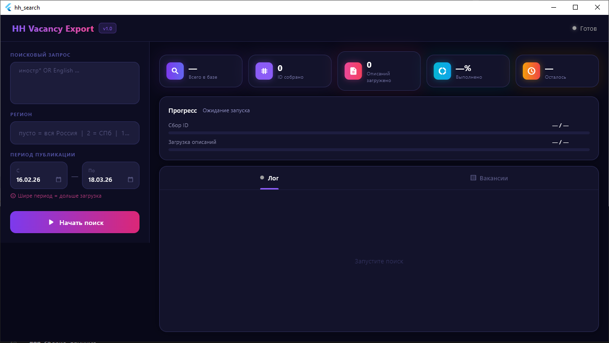

# HH Vacancy Export

Десктопное приложение для массовой выгрузки вакансий с [hh.ru](https://hh.ru) в форматы **CSV** и **Excel (.xlsx)**.

Разработано на Flutter — работает на Windows и macOS.

---

## Возможности

- Поиск вакансий по произвольному запросу (поддерживается язык запросов hh.ru: `OR`, `AND`, wildcards `*`)
- Фильтрация по региону и периоду публикации
- Автоматический обход ограничения API в 2000 результатов — диапазон дат дробится рекурсивно
- Загрузка **полного текста описания** каждой вакансии
- Просмотр результатов прямо в приложении с поиском по таблице
- Экспорт в **CSV** (UTF-8, разделитель `;`) и **Excel** с оформленным заголовком
- Нативный диалог сохранения файла (Windows / macOS)
- Тёмный современный интерфейс с индикаторами прогресса
- Поддержка паузы и отмены загрузки

---

## Скриншоты



---

## Сборка

Готовые бинарники собираются автоматически через GitHub Actions при каждом push в `main`.

Скачать можно во вкладке **[Actions](../../actions)** → последний успешный запуск → раздел **Artifacts**:

| Файл | Платформа |
|------|-----------|
| `hh_search_windows.zip` | Windows 10/11 (x64) |
| `hh_search_macos.zip` | macOS 12+ (arm64 / x86_64) |

### Сборка вручную

**Требования:** Flutter 3.38+

```bash
# Клонировать репозиторий
git clone https://github.com/Siriess/hh_search.git
cd hh_search

# Установить зависимости
flutter pub get

# Windows
flutter build windows --release \
  --dart-define=HH_CLIENT_ID=ВАШ_CLIENT_ID \
  --dart-define=HH_CLIENT_SECRET=ВАШ_CLIENT_SECRET

# macOS
flutter build macos --release \
  --dart-define=HH_CLIENT_ID=ВАШ_CLIENT_ID \
  --dart-define=HH_CLIENT_SECRET=ВАШ_CLIENT_SECRET
```

---

## Настройка API-ключей

Приложение использует официальный API hh.ru. Ключи **не хранятся в коде** — они передаются при сборке через `--dart-define` и хранятся в GitHub Secrets.

### Получение ключей

1. Зайдите на [dev.hh.ru](https://dev.hh.ru)
2. Войдите через свой аккаунт hh.ru
3. Создайте новое приложение (название и redirect URI — любые)
4. Скопируйте `Client ID` и `Client Secret`

### Добавление секретов в GitHub (для CI/CD)

Перейдите в **Settings → Secrets and variables → Actions** репозитория и добавьте два секрета:

| Имя | Значение |
|-----|---------|
| `HH_CLIENT_ID` | ваш Client ID |
| `HH_CLIENT_SECRET` | ваш Client Secret |

---

## Использование

1. Запустить `hh_search.exe` (Windows) или `hh_search.app` (macOS)
2. В поле запроса уже вписан пример поиска вакансий с требованием к иностранному языку:
   ```
   иностр* OR foreign OR English OR англ* OR зарубеж* OR A1 OR A2 OR B1 OR B2 OR C1 OR международ* OR перевод*
   ```
3. При необходимости указать **ID региона** (пусто = вся Россия, `1` = Москва, `2` = Санкт-Петербург)
4. Выбрать **период публикации** (чем шире — тем дольше)
5. Нажать **«Начать поиск»**
6. Дождаться загрузки → вкладка **«Вакансии»** для просмотра
7. Нажать **«Excel»** или **«CSV»** → выбрать куда сохранить

### Как работает обход лимита 2000

API hh.ru возвращает максимум 2000 результатов на один запрос. Приложение обходит это так:

```
Запрос за 30 дней → found=143857 > 2000
  → делим пополам: первые 15 дней → found=70000 > 2000
      → делим: первые 7 дней → found=2800 > 2000
          → делим: первые 3.5 дня → found=1400 ✓ → собираем 14 страниц
          → вторые 3.5 дня → found=1500 ✓ → собираем 15 страниц
      → вторые 8 дней → ...и так далее
```

---

## Колонки в экспорте

| Колонка | Описание |
|---------|---------|
| ID | Идентификатор вакансии на hh.ru |
| Название вакансии | Заголовок вакансии |
| Описание | Полный текст описания (HTML очищен) |
| Работодатель | Название компании |
| Регион | Город / регион |
| Дата публикации | Дата в формате ISO 8601 |
| Ссылка | Прямая ссылка на вакансию |

---

## Стек

- [Flutter](https://flutter.dev) 3.38 — UI фреймворк
- [http](https://pub.dev/packages/http) — HTTP запросы
- [csv](https://pub.dev/packages/csv) — генерация CSV
- [excel](https://pub.dev/packages/excel) — генерация XLSX
- [file_picker](https://pub.dev/packages/file_picker) — нативный диалог сохранения
- [html](https://pub.dev/packages/html) — парсинг HTML-описаний
- [intl](https://pub.dev/packages/intl) — форматирование чисел и дат
